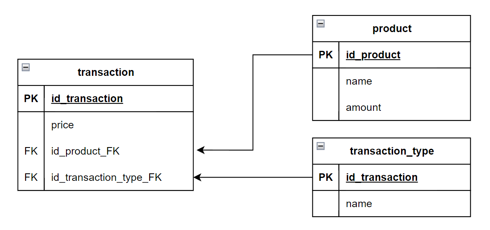

# api.transactions

API para validação do conhecimento em spring e micro-serviços

## Escopo

"Um comerciante precisa controlar o seu fluxo de caixa diário com os lançamentos (débitos e  créditos), também precisa de um relatório que disponibilize o saldo diário consolidado".

## Projeto

Para criação do projeto foi estruturado o seguinte modelo de banco de dados

A tabela **product** foi adicionada para criar um 
contexto de negócio para a aplicação e mostrar a possibilidade 
de escala e extensão do sistema existente, apenas acoplando 
novas tabelas à base principal (transaction e transaction_type)

Abaixo modelo relacionando os principais componentes e ferramentas que 
envolvem a aplicação

## Ferramentas e setup

- JDK 17
- Intellij IDEA
- Docker desktop
- Postman

Para execução do projeto é necessária a criação do banco de dados, 
que pode ser feita utilizando o arquivo docker-compose na pasta
"docker" na raiz do projeto.

Abrir um prompt de comando na pasta 
"docker" e executar o seguinte comando:

`docker-compose up -d`

As tabelas serão criadas automaticamente com registros básicos
utilizando **flyway migrations** quando o projeto java for
iniciado.

## Documentação

Todos os arquivos de documentação estão na pasta "doc" na raiz
do projeto, são eles:

- Modelo de banco de dados editável ([draw.io](https://app.diagrams.net/))
- Collection postman para testes da API
- Desenho da arquitetura

Ao executar a aplicação localmente, a documentação swagger pode ser acessada através
do link: localhost: [http://localhost:8080/swagger-ui/index.html](http://localhost:8080/swagger-ui/index.html)

As collections organizadas usadas para testes estão disponíveis em:
[Postman Collection](https://github.com/Gussriquena/api.transactions/blob/main/doc/teste.postman_collection.json)

## Dependências

- Java 17
- Spring 3.0.7
- Lombok
- PostgreSQL
- Flyway Migrations
- spring-boot-starter-data-jpa
- spring-boot-starter-web
- spring-boot-starter-test
- springdoc-openapi-ui
- springdoc-openapi-starter-webmvc-ui

## Versionamento

Para versionamento de código está sendo utilizado repositório
público no **Github**.

[Gitmoji](https://gitmoji.dev/) com [Commit Conventional](https://gist.github.com/qoomon/5dfcdf8eec66a051ecd85625518cfd13) é o padrão adotado para mensagens
de commit.

